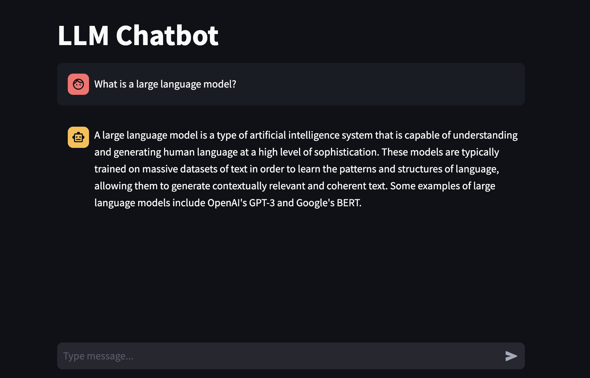

# LLM Chatbot Template

A containerised LLM chatbot app template for rapidly deploying chatbot prototypes.



## Getting Started

### Prerequisites

- Python
- Docker

### Installation

1. Install Python dependencies

```sh
python3 -m venv venv &&\
source venv/bin/activate &&\
pip install -r requirements.txt
```

2. Add OpenAI API key to environment variables

```sh
touch .env &&\
echo "<YOUR API KEY>" >> .env
```

### Usage

1. Build the Docker image

```sh
docker build -t chatbot .
```

2. Run the Docker image, exposing port 8501

```sh
docker run -p 8501:8501 chatbot
```

3. Access the bot in the browser at `http://localhost:8501/`
